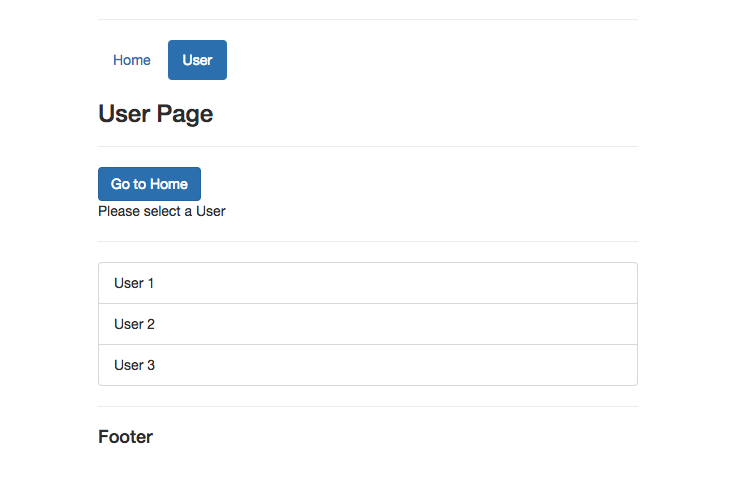

# Tutorial vue-route 

> Vue-Route tutorial


## Build Setup

``` bash
# IDE
Webstorm

# create vue project 
select Vue-CLI project in webstorm

# add bootstrap to package.json
"bootstrap": "^3.3.7"

# add to main.js
import 'bootstrap/dist/css/bootstrap.min.css'
- and after use boostrap library 

# install dependencies
npm install

# serve with hot reload at localhost:8080
npm run dev

# build for production with minification
npm run build

# build for production and view the bundle analyzer report
npm run build --report

# Reference
online udemy study
Maximilian Schwarzmuller
```

## Project sturct


## Result
